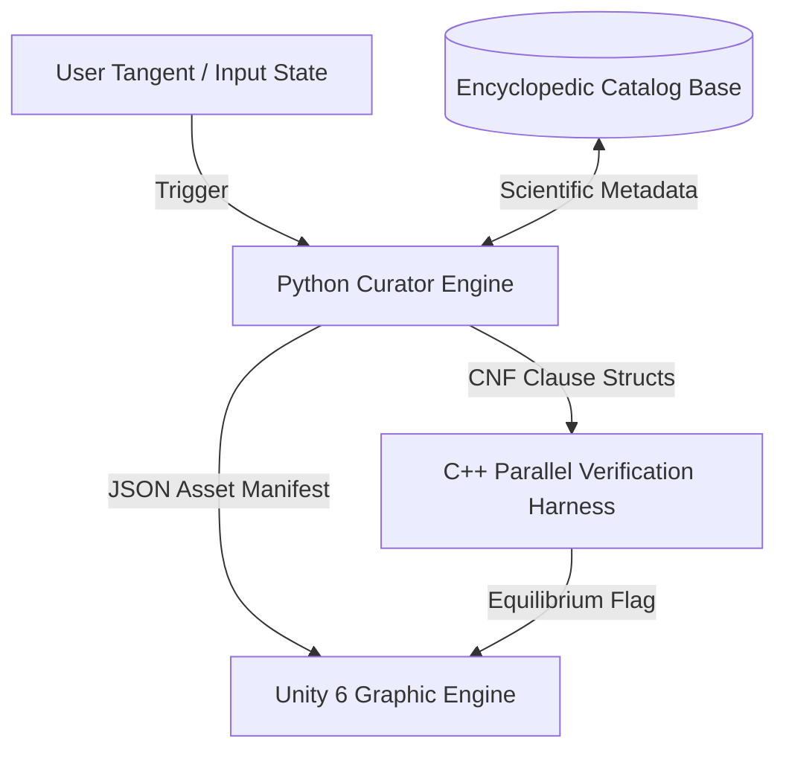

# EncyclopedicCatalog

An advanced, metadata-driven asset indexing framework designed for **Generative Cinematic Continuity (GCC)** and multi-variable industrial simulation platforms.

## Overview

**Generative Cinematic Continuity (GCC)** bridges open-ended narrative experiences with engineering sandboxes. By enforcing absolute state persistence, the system guarantees that if a user breaks away into an arbitrary choice path, the underlying environment obeys the strict deterministic physical, mathematical, and chemical realities of the universe.

The `EncyclopedicCatalog` serves as the authoritative context broker layer. It indexes structural constraints, thermal properties, and compound molecular data tracks, transforming physical boundaries on-the-fly into structured **3SAT constraint clause sets** to be verified by low-level, high-performance backends before rendering spatial assets in game engines.

## System Architecture

## Repository Composition Matrix

This repository implements a production-ready blueprint partitioned into three operational language components:

### 1. Context Curation & Logic Generation (`curator_engine.py`)
- **Scientific Catalog Tracking**: Maps spatial assets directly to static physical constants (density, melting point) and chemical tracks (pH profiles, formula structures).
- **Boolean Transformation Engine**: Maps structural lattice configurations and attachment stress profiles into integer Conjunctive Normal Form (CNF) chunks formatted for standard 3SAT solvers.

### 2. High-Performance Processing Core (`DimacsParser.cpp`)
- **Zero-Copy Ingestion Array**: Swiftly parses incoming variable arrays straight into optimized internal vectors without parsing overhead.
- **Parallel Verification Harness**: Spreads large-scale clause matrices across local CPU worker architectures via `std::async` threads, allowing full-scale material stress validation loops to execute under short-circuit optimization constraints.

### 3. Real-Time Front-End Client Runtime (`Unity 6 Core Scripts`)
- **`RuntimeAssetWatcher.cs`**: Ingests, parses, and executes structural layout updates dynamically using performant `JsonUtility` wrappers.
- **`CatalogNetworkClient.cs`**: Handles an asynchronous internet communication client layer using `UnityWebRequest` loops to smoothly fetch environment state targets from a Python orchestration socket wrapper.

## Verification Workflow Deployment

To verify the system end-to-end:
1. Initialize the Python broker to format your environment layout properties.
2. Direct the serialized clause array down to the C++ parallel harness to verify physical boundary equilibrium.
3. Broadcast the confirmed matrix directly up to the running Unity 6 client runtime node to mutate scene layout values instantly.
