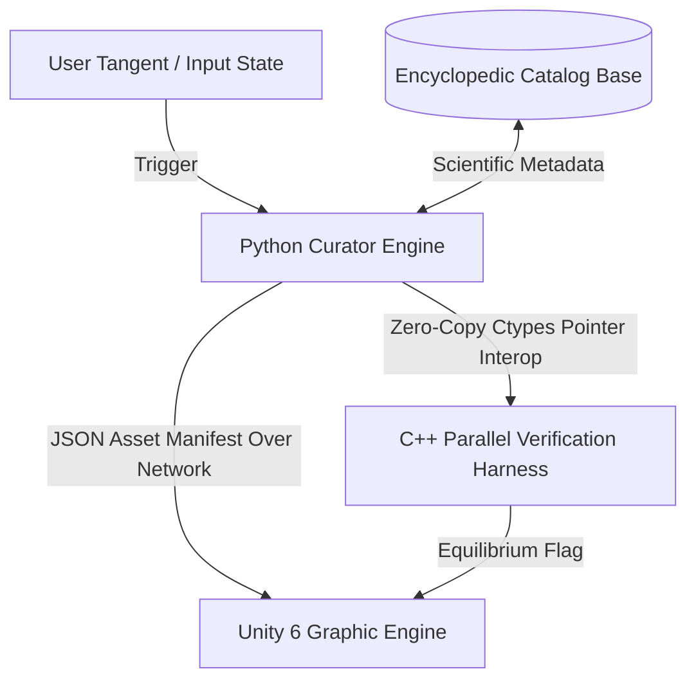

# EncyclopedicCatalog

A high-fidelity, metadata-driven asset indexing and logical verification framework designed for **Generative Cinematic Continuity (GCC)** and multi-variable industrial simulation platforms.

## Overview

**Generative Cinematic Continuity (GCC)** bridges open-ended narrative experiences with rigorous engineering sandboxes. By enforcing absolute state persistence, the system guarantees that if a user breaks away into an arbitrary choice path, the underlying environment obeys the strict deterministic physical, mathematical, and chemical realities of the universe.

The `EncyclopedicCatalog` serves as the authoritative context broker layer. It indexes structural constraints, thermal properties, and compound molecular data tracks, transforming physical boundaries on-the-fly into structured **3SAT constraint clause sets** to be verified by low-level, high-performance backends before rendering spatial assets in game engines.

## System Architecture



---

## Component Layout

The framework is partitioned into three operational decoupled components:

### 1. Context Curation & Logic Generation (`curator_engine.py`)
- **Scientific Catalog Tracking**: Maps spatial assets directly to static physical constants (density, melting point) and chemical tracks (pH profiles, formula structures).
- **Boolean Transformation Engine**: Maps structural lattice configurations and attachment stress profiles into integer Conjunctive Normal Form (CNF) chunks formatted for standard 3SAT solvers.

### 2. High-Performance Processing Core (`DimacsParser.cpp`)
- **Dual-Mode Ingestion Array**: Parses standard text-based `.cnf` files from disk or ingests flattened, 1D streaming pointer blocks directly via memory pointers from the Python runtime layer.
- **Parallel Verification Harness**: Spreads large-scale clause matrices across local CPU worker architectures via `std::async` threads, allowing full-scale material stress validation loops to execute under short-circuit optimization constraints.

### 3. Real-Time Front-End Client Runtime (`Unity 6 Core Scripts`)
- **`RuntimeAssetWatcher.cs`**: Ingests, parses, and executes structural layout updates dynamically using performant `JsonUtility` wrappers. Handles high-speed asynchronous instantiation directly from the catalog key.
- **`CatalogNetworkClient.cs`**: Handles an asynchronous internet communication client layer using `UnityWebRequest` loops to smoothly fetch environment state targets from a Python orchestration socket wrapper.

---

## Build Process & Automation Blueprint

To achieve zero-copy performance and eliminate any file-I/O latency, the repository leverages a cross-platform compilation script to build a shared C-compatible native library that Python invokes directly via memory pointers.

### Compiling the Shared Native Backend
Run the automated **`build_shared.sh`** toolchain script. This auto-detects the host architecture, applies aggressive optimization flags (`-O3`), and generates the target binary file:

```bash
# 1. Provide execution permissions to the toolchain script
chmod +x build_shared.sh

# 2. Run the native hardware build pipeline
./build_shared.sh
```

- **macOS Output**: `libverification.dylib`
- **Linux Output**: `libverification.so`
- **Windows Output**: `libverification.dll` (Compiled via MinGW environment)

---

## Unity 6 Addressables System Architecture

To transition away from simple mock objects and move toward **production-grade engineering simulations**, the runtime swaps manual field transforms for Unity's **Addressables Asset System**. This allows the engine to load hyper-detailed 3D meshes, physical structural profiles, and custom shaders at runtime directly from string keys provided by the catalog.

### Scene Setup & Group Configuration
1. **Package Installation**: Ensure the **Addressables package** is installed via the Unity Package Manager.
2. **Marking Assets**: Select any prefab, mesh, or material intended for dynamic deployment and check the **Addressable** checkbox in its Inspector window.
3. **Key Registration**: Explicitly configure the Addressable key name string (e.g., `models/industrial/pipe_heavy_v3.gltf`) to exactly match the target `mesh_source` metadata field registered within the Python `ScientificAssetCatalog` payload loop.
4. **Memory Optimization**: The front-end framework caches active asset handles inside an internal dictionary. When a user shifts tangents, the system automatically calls `Addressables.ReleaseInstance()` to clear the allocations inside the runtime asset engine pool and block memory leaks.

---

## Verification Workflow Deployment

To verify the system end-to-end:
1. Initialize the Python broker (`python curator_engine.py`) to format your environment layout properties.
2. The broker marshals the compiled dynamic clause array down to the multi-threaded C++ parallel harness via a direct `ctypes` pipeline to verify physical boundary equilibrium.
3. Broadcast the confirmed matrix directly up to the running Unity 6 client runtime node over the network stream to mutate scene layout values instantly.
