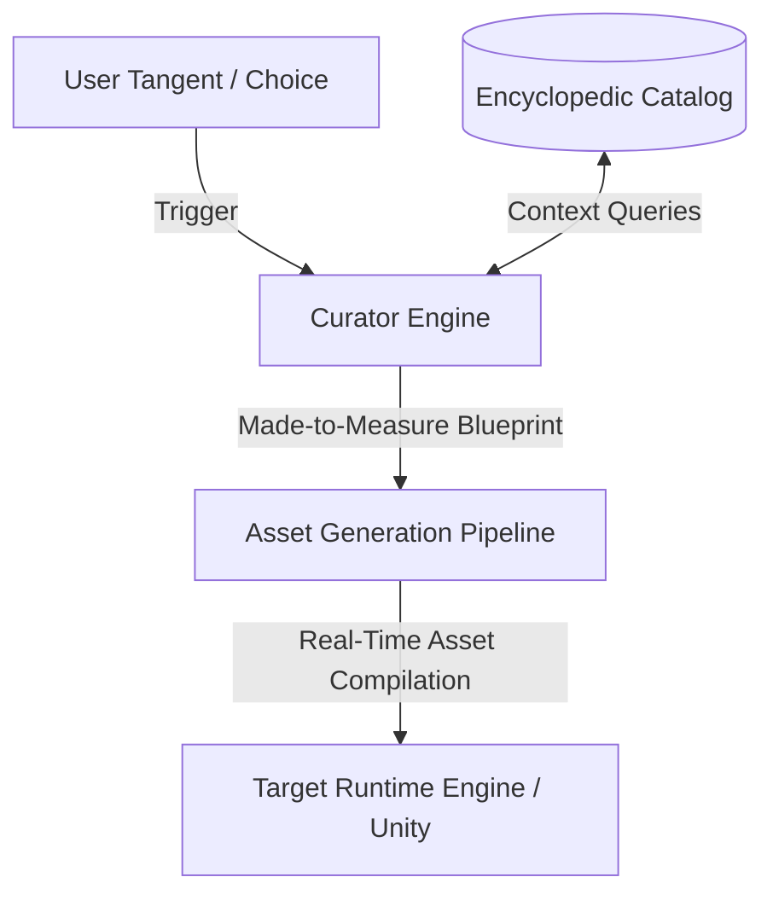

# EncyclopedicCatalog

A metadata-driven asset indexing framework designed for **Generative Cinematic Continuity (GCC)**. This repository acts as the authoritative world-state and context ledger required to piece together game-like movie assets dynamically and on-the-fly.

## Overview

Traditional entertainment relies on fixed branching paths. **Generative Cinematic Continuity (GCC)** introduces infinite narrative freedom by allowing users to explore arbitrary tangents while maintaining rigorous consistency across characters, environments, and physics. 

The `EncyclopedicCatalog` serves as the central context broker. It stores structural boundaries and semantic data tags, allowing a downstream **Curator Engine** to query and filter real-time asset specifications (meshes, text, textures, or animations) precisely when a user dictates a shift in the story.

## System Architecture



1. **The Catalog Schema**: Houses deep structural constraints, emotional vectors (e.g., Want vs. Need), environment state matrices, and generative engine parameters.
2. **The Curator Logic**: Evaluates the incoming runtime narrative beat against active constraints to select matching or "made-to-measure" assets.
3. **Pipeline Alignment**: Delivers standardized structural specifications to local or cloud-based AI generation models to produce persistent additions to the runtime environment.

## Getting Started

### Prerequisites
- Python 3.8+
- `typing_extensions` (for strict static type verification)

### Running the Reference Implementation
To test the dynamic curation selection algorithm locally, execute the reference script:
```bash
python curator_engine.py
```
